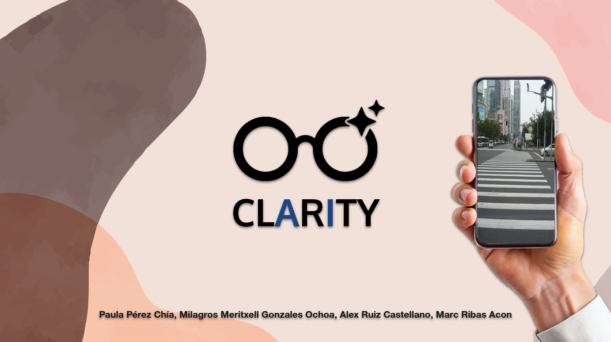
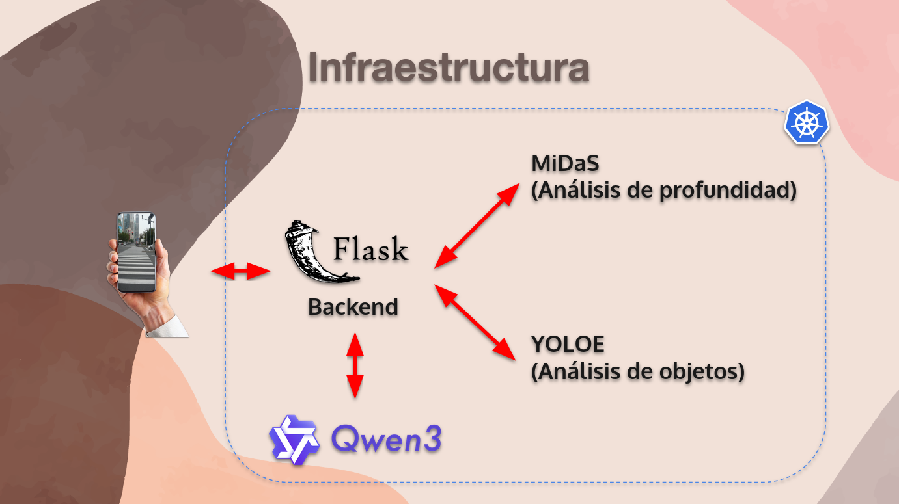
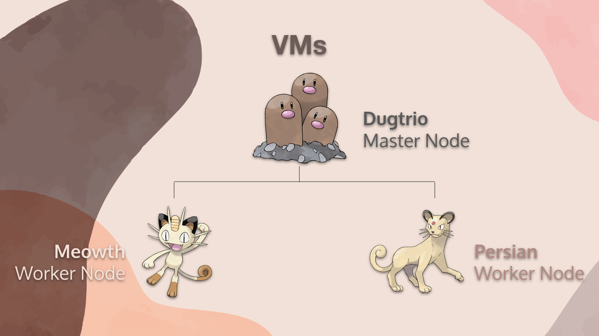

# Clarity

Un asistente de navegación self-hosted, impulsado por IA, para personas ciegas y con baja visión, que permite una navegación más segura e independiente por las calles mediante detección de objetos en tiempo real, estimación de distancia y retroalimentación de audio.

## Descripción General

Clarity combina una aplicación móvil con una infraestructura backend sofisticada para proporcionar a usuarios ciegos descripciones detalladas y auditivas de su entorno en tiempo real. Al aprovechar modelos avanzados de visión por computadora y modelos de lenguaje grandes, el sistema transforma las escenas callejeras en orientación de audio procesable, ayudando a los usuarios a navegar con confianza.

### Características Principales

- **Detección de Objetos en Tiempo Real**: Identifica objetos en el entorno del usuario (autos, peatones, semáforos, etc.)
- **Estimación de Distancia**: Determina la distancia de los objetos detectados respecto al usuario
- **Orientación Contextual**: Genera descripciones inteligentes del escenario en lenguaje natural
- **Retroalimentación de Audio**: Convierte descripciones de texto en voz sintetizada clara
- **Diseño Orientado a Privacidad**: Completamente self-hosted sin dependencias de servicios en la nube
- **Capaz de Funcionar sin Conexión**: Se ejecuta completamente en infraestructura controlada por el usuario

## Arquitectura

### Componentes del Sistema

### Descripción de Servicios

#### **App Móvil Flutter** (Android)
- Captura imágenes desde la cámara del dispositivo
- Envía imágenes al servicio backend
- Recibe y reproduce respuestas de audio
- Proporciona interfaz de usuario para asistencia de navegación

#### **Servicio Backend** (`servicio_backend/`)
El centro de orquestación del sistema que:
1. Recibe solicitudes de imagen desde la app móvil
2. Enruta imágenes a través del pipeline de IA
3. Recopila resultados de MiDaS (distancia) y YOLOe (identificación de objetos)
4. Fusiona las salidas de ambos modelos para crear una comprensión completa de la escena
5. Envía datos fusionados al LLM con contexto sobre objetos detectados y distancias
6. Recibe descripciones en lenguaje natural desde el LLM
7. Convierte descripciones a audio usando síntesis de voz
8. Devuelve archivo de audio a la app móvil

#### **Servicio MiDaS** (`servicio_midas/`)
Modelo de estimación de profundidad que:
- Analiza imágenes para determinar la distancia de objetos desde la cámara
- Proporciona mapas de profundidad para comprensión espacial
- Genera información de distancia para cada región detectada

#### **Servicio YOLOe** (`servicio_yolo/`, `servicio_yoloe/`)
Modelos de detección de objetos que:
- Identifica objetos en la escena (vehículos, peatones, semáforos, obstáculos, etc.)
- Proporciona etiquetas de clase y puntuaciones de confianza
- Permite comprensión semántica del entorno

#### **Servicio LLM** (`llm-backend-deployment`)
Modelo de Lenguaje Grande que:
- Recibe datos estructurados: identidades de objetos y distancias
- Genera descripciones naturales y conversacionales
- Produce texto amigable para audio adecuado para síntesis de voz en tiempo real
- Proporciona advertencias y sugerencias de navegación contextualizadas

## Implementación

### Descripción General de Infraestructura

Clarity está diseñado para ejecutarse en Kubernetes, permitiendo implementaciones escalables y confiables. La infraestructura se define a través de:

- **Manifiestos Kubernetes** (`kubernetes-deployments/`): Archivos de implementación directa en Kubernetes
- **Gráficos Helm** (`helm-clarity-stack/`): Gráficos Helm personalizados para implementaciones flexibles específicas del entorno

### Componentes de Kubernetes

El sistema implementa los siguientes servicios en un clúster Kubernetes:

1. **Servicio Backend**: Servicio de orquestación principal que maneja solicitudes API
2. **Implementación MiDaS**: Contenedor de inferencia para estimación de profundidad
3. **Implementación YOLOe**: Contenedor de inferencia para detección de objetos
4. **Implementación LLM Backend**: Servicio de inferencia del modelo de lenguaje

Cada servicio está containerizado y puede escalarse independientemente según la demanda.

### Configuración

- **Docker**: Todos los servicios están containerizados (ver `Dockerfile` en cada directorio de servicio)
- **Valores Helm**: Personaliza implementaciones a través de `helm-clarity-stack/values.yaml`
- **Docker Compose**: Configuración de entorno de desarrollo en `docker-compose.yml`

## Flujo de Datos

1. **Captura de Imagen**: El usuario apunta el dispositivo al entorno, la app captura la imagen
2. **Solicitud Backend**: La imagen se envía al servicio backend a través de API
3. **Procesamiento MiDaS**: La estimación de profundidad genera mapas de distancia
4. **Procesamiento YOLOe**: La detección de objetos identifica elementos de la escena
5. **Fusión de Resultados**: El backend combina información de distancia + identidad de objetos
6. **Generación LLM**: Datos estructurados de la escena se envían al LLM para generación en lenguaje natural
7. **Síntesis de Audio**: Texto generado convertido a voz
8. **Entrega a App**: Archivo de audio devuelto a la app móvil y reproducido al usuario

## Stack de Despliegue

Clarity aprovecha un conjunto moderno de herramientas y plataformas para garantizar despliegues sencillos, confiables y automatizados. Esto es especialmente importante dado que el objetivo del proyecto es ayudar a personas ciegas, por lo que la facilidad de despliegue y mantenimiento es crítica.

### Infraestructura Base: OpenNebula

El proyecto utiliza 3 máquinas virtuales proporcionadas por OpenNebula de la FIB como infraestructura base.

### Orquestación: k3s (Kubernetes Simplificado)

Clarity utiliza **k3s**, una distribución de Kubernetes ligera y fácil de desplegar:
- **Instalación Simplificada**: Un solo comando para desplegar un clúster Kubernetes funcional
- **Bajo Consumo de Recursos**: Ideal para entornos con recursos limitados
- **Facilidad Operacional**: Reduce significativamente la complejidad de gestionar Kubernetes
- **Énfasis en Accesibilidad**: La simplicidad de k3s asegura que incluso usuarios sin experiencia profunda en Kubernetes puedan desplegar y mantener el sistema

### Monitorización: Kubernetes Dashboard

El proyecto incluye el **Kubernetes Dashboard** para proporcionar:
- **Interfaz Web Intuitiva**: Dashboard web para monitorización y control de la infraestructura sin necesidad de línea de comandos
- **Gestión Visual**: Control visual de pods, servicios, despliegues y recursos del clúster
- **Accesibilidad**: Facilita el monitoreo del estado del sistema para administradores

### Integración Continua: GitHub Actions

**GitHub Actions** automatiza la construcción y distribución de artefactos del proyecto:
- **Construcción de Imágenes Docker**: Compilación automática de imágenes Docker para cada servicio (backend, MiDaS, YOLOe, LLM)
- **Construcción de APKs Flutter**: Generación automática de APKs compiladas de la aplicación móvil
- **CI/CD Integrado**: Pipeline automático que ejecuta pruebas, construye imágenes y las publica en registros Docker
- **Facilidad de Actualización**: Los desarrolladores solo necesitan hacer push a repositorio, el resto sucede automáticamente

### Despliegue Continuo: ArgoCD

**ArgoCD** mantiene la infraestructura siempre sincronizada y actualizada:
- **GitOps Declarativo**: Define el estado deseado del clúster en Git (Helm charts o manifiestos Kubernetes)
- **Sincronización Automática**: ArgoCD monitorea los repositorios Git y automáticamente desplega cambios al clúster
- **Versionado de Despliegues**: Historial completo de cambios en la infraestructura a través de Git
- **Facilidad Operacional**: No es necesario usar `kubectl apply` manualmente; ArgoCD automáticamente mantiene el clúster actualizado
- **Rollbacks Sencillos**: Revertir a versiones anteriores es tan simple como revertir un commit en Git

### Pipeline Completo

El flujo de despliegue es completamente automatizado:

1. **Desarrollo**: Los desarrolladores hacen push de cambios a GitHub
2. **CI**: GitHub Actions automáticamente:
   - Construye imágenes Docker para servicios backend
   - Compila la app Flutter generando APKs
   - Sube imágenes a un registry Docker
3. **CD**: ArgoCD automáticamente:
   - Detecta cambios en los Helm charts o manifiestos Kubernetes
   - Sincroniza automáticamente el clúster con el estado deseado
   - Desplega nuevas versiones de servicios

Esta arquitectura enfatiza la **facilidad de despliegue** y **mantenimiento**, lo cual es fundamental para un servicio dirigido a ayudar a personas ciegas. Con esta aproximación, el stack completo puede ser desplegado y mantenido con mínima intervención manual, reduciendo errores y garantizando disponibilidad del servicio.

## Privacidad y Seguridad

- **Sin Dependencia de Nube**: Todo el sistema se ejecuta en infraestructura self-hosted
- **Procesamiento de Imágenes**: Las imágenes se procesan localmente y no se almacenan en servicios externos
- **Control de Datos**: Control completo sobre todos los datos y salidas de modelos
- **Operación sin Conexión**: Todos los componentes se ejecutan dentro de tu red
